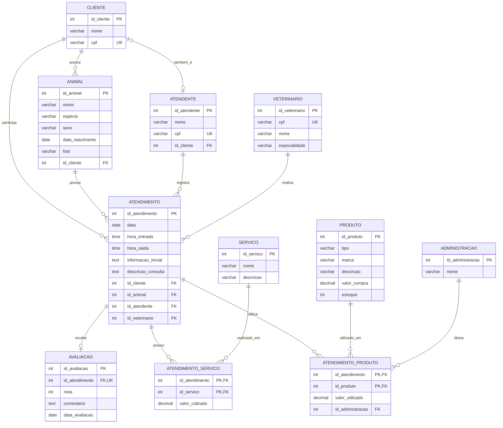

# Clínica Veterinária

## Apresentação

Este projeto consiste no desenvolvimento de um banco de dados relacional para o gerenciamento de uma clínica veterinária. O sistema foi elaborado para organizar as principais informações relacionadas ao atendimento de animais domésticos, seus respectivos tutores, atendentes, veterinários, produtos e serviços oferecidos pela clínica.

A proposta é centralizar essas informações em uma estrutura organizada, permitindo registrar o histórico dos atendimentos, os profissionais envolvidos, os produtos utilizados, os serviços realizados e o controle de estoque dos produtos disponíveis na clínica.

## Objetivo

O objetivo deste projeto é desenvolver um banco de dados relacional capaz de armazenar e organizar as informações necessárias para o funcionamento de uma clínica veterinária.

O sistema deve permitir o cadastro de clientes e seus animais, o registro dos atendimentos realizados, a identificação do atendente e do veterinário responsável, o controle dos produtos disponíveis em estoque e o registro dos serviços realizados durante cada atendimento.

Além disso, o banco de dados deve manter as relações entre essas informações, garantindo maior organização, consistência e facilidade de consulta dos dados.

## Público-alvo

O projeto é destinado principalmente a clínicas veterinárias e aos profissionais envolvidos em suas atividades, como veterinários, atendentes e funcionários responsáveis pela administração.

A estrutura proposta pode auxiliar no gerenciamento dos animais atendidos, no acompanhamento do histórico clínico, no controle dos produtos utilizados e no registro dos serviços realizados pela clínica.

## Modelo de Dados

## Inovação: Avaliação de Atendimentos

Como elemento inovador desta fase, foi adicionada a funcionalidade de **avaliação de atendimentos**, dentro da categoria de Interações Sociais.

Após cada atendimento, o tutor pode avaliar o serviço prestado atribuindo uma nota de 1 a 5 estrelas e, opcionalmente, deixar um comentário. Essa informação é armazenada na nova tabela `AVALIACAO`, relacionada 1:1 com `ATENDIMENTO` (cada atendimento pode ter no máximo uma avaliação).

Essa funcionalidade agrega valor ao sistema por permitir que a clínica acompanhe a satisfação dos tutores, identifique pontos de melhoria no atendimento e reforce a confiança dos clientes na qualidade do serviço prestado.

### Protótipo de Interface

Foi desenvolvido um protótipo da tela de gerenciamento de atendimentos, já incorporando a funcionalidade de avaliação: [Protótipo de Interface](https://htmlpreview.github.io/?https://github.com/Gabe01165-bit/clinica-veterinaria/blob/main/prototipo/prototipo-atendimentos.html)

